# Project Handbook — theory, method, and how to reproduce everything

*CNNs vs Vision Transformers: A Controlled Comparison under Transfer Learning*
EC789 Major Project · Praveen Raj Konatham (252SP014) · M.Tech SPML, ECE, NITK Surathkal
Guide: Dr. Bini A A

---

## 0. How to use this document

This is written to be self-contained. Someone who has never seen the project
should be able to read this file top to bottom and then reproduce every number in
it, without needing another source.

- **Sections 1–3** are background. Read them if terms like *convolution*,
  *attention* or *transfer learning* are not already familiar.
- **Sections 4–6** are the method: exactly what was run, and why each choice was
  made rather than some other choice.
- **Section 7** is the code, file by file.
- **Section 8** is the step-by-step reproduction recipe.
- **Section 9** is the results.
- **Section 10** lists the mistakes made along the way. It is probably the most
  useful section for anyone doing similar work.

Mathematical notation is kept light. Where a formula appears it is followed by a
plain-language reading of what it does.

---

## 1. The problem

Suppose you have a model that has already been trained on a very large collection
of general photographs, and you want it to solve *your* task, for which you have
far fewer labelled images. This is the ordinary situation in applied computer
vision — almost nobody has a million labelled images of their own problem.

Two broad families of architecture are available:

- **Convolutional neural networks (CNNs)**, the mature choice, represented here by
  **ResNet-50**.
- **Vision Transformers (ViTs)**, adapted from language models in 2020,
  represented here by **ViT-B/16**.

The literature does not answer cleanly which to pick, because published
comparisons usually differ in several ways at once: different pre-training
corpora, different augmentation recipes, different training lengths, different
compute budgets. A conclusion drawn from such a comparison is not isolated from
those confounds.

**This project fixes everything except the architecture, and then asks not only
which model scores higher, but what each one depends on.**

The problem statement, as submitted:

> Vision Transformers now lead image-classification benchmarks, but those results
> rely on large-scale pre-training and compute, and most published CNN-versus-ViT
> comparisons vary many factors at once. This project fine-tunes a representative
> CNN and a representative ViT under a single controlled transfer-learning
> protocol and compares how the two families behave — beginning with their
> efficiency in low-data regimes and their robustness to input degradation. The
> aim is to characterise not just which model scores higher, but how and why each
> one behaves as it does.

---

## 2. Background: the image-classification setup

A classifier is a function that maps an image to a category.

An RGB image at this project's working resolution is a tensor

    x ∈ R^(3 × 224 × 224)

— three colour channels, 224 pixels high, 224 wide. The model produces a vector of
**logits**, one per category:

    z = f(x; θ) ∈ R^C,   C = 256 for Caltech-256

where θ are the model's learned parameters. Logits are unbounded scores. They are
converted to probabilities by the **softmax**:

    p_i = exp(z_i) / Σ_j exp(z_j)

which forces the values to be positive and sum to 1. The predicted class is
`argmax_i p_i`, and `max_i p_i` is the model's **confidence** — a number this
project uses later for calibration analysis.

Training minimises **cross-entropy loss** between the predicted distribution and
the true label y:

    L = − log p_y

Reading it plainly: the loss is small when the model assigned high probability to
the correct answer, and grows without bound as that probability approaches zero.
Minimising it over many examples is what "training" means.

---

## 3. The two architectures

### 3.1 Convolutional networks, and ResNet-50

The **convolution** is the core operation. A small filter (kernel) of learned
weights slides across the image, and at each position computes a weighted sum of
the pixels beneath it:

    y[i, j] = Σ_m Σ_n  w[m, n] · x[i + m, j + n]  +  b

Three properties follow, and they are the reason CNNs work well on images:

1. **Locality** — each output depends only on a small neighbourhood of input.
2. **Weight sharing** — the same filter is applied everywhere, so a pattern
   learned in one part of the image is recognised anywhere in it.
3. **Translation equivariance** — shift the input, and the output shifts with it.

These are *inductive biases*: assumptions built into the architecture rather than
learned from data. They are why CNNs are efficient learners on images — they do
not have to discover from scratch that images are spatially structured.

Stacking convolutions makes deep networks, but naively deep networks train badly.
The specific failure He et al. (2016) identify is *degradation*: adding layers to
a plain network makes even its TRAINING error worse, which cannot be overfitting.
They are explicit that this is not simply vanishing gradients — batch
normalisation already largely addresses those — but an optimisation difficulty in
approximating identity mappings through many nonlinear layers. **ResNet** solves
it with a *residual connection*:

    y = F(x) + x

The block learns a *correction* F(x) to its input rather than a whole new
representation. If the best thing to do is nothing, the block can drive F(x)
toward zero and pass x through — so in principle adding depth need not hurt. This
is what made 50-layer and deeper networks trainable.

**ResNet-50** used here:

| property | value |
|---|---|
| parameters | 24.0 M |
| compute at 224×224 | 4.09 GMACs |
| feature dimension | 2048 |
| pre-training | ImageNet-1k (timm tag `resnet50.a1_in1k`) |

It has 50 weighted layers arranged in four stages. Spatial resolution halves at
each stage while channel count doubles — the standard pyramid. After the last
stage, global average pooling reduces each channel to a single number, giving a
2048-dimensional feature vector, which a final linear layer maps to class scores.

### 3.2 Transformers, attention, and ViT-B/16

Transformers came from language modelling (Vaswani et al., 2017). Their core
operation is **self-attention**, which lets every element of a sequence consult
every other element directly.

Given a sequence of N vectors packed into a matrix X ∈ R^(N × d), three linear
projections produce queries, keys and values:

    Q = X·W_Q,   K = X·W_K,   V = X·W_V

and attention is

    Attention(Q, K, V) = softmax( Q·Kᵀ / √d_k ) · V

Reading it step by step:

- `Q·Kᵀ` computes a similarity score between every pair of elements. Element i
  asks, via its query, how relevant every other element's key is.
- Dividing by `√d_k` keeps those scores from growing with dimension, which would
  otherwise push the softmax into a region where gradients vanish.
- `softmax` turns each row of scores into weights summing to 1.
- Multiplying by V produces, for each element, a weighted average of all elements'
  values — weighted by relevance.

**Multi-head attention** runs h of these in parallel with separate projections and
concatenates the results, so different heads can attend to different kinds of
relationship simultaneously.

The crucial difference from convolution: attention is **global from layer one**.
A CNN needs many layers before two distant pixels can influence each other; a
transformer relates any two positions in a single operation.

**Vision Transformer** (Dosovitskiy et al., 2021) applies this to images by
turning a picture into a sequence:

1. **Patch embedding.** Cut the 224×224 image into non-overlapping 16×16 patches.
   That gives (224/16)² = 14 × 14 = **196 patches**. Flatten each patch to a
   vector of 16·16·3 = 768 values and project it linearly to the model dimension
   (also 768 here). Implemented as a strided convolution.
2. **Class token.** Prepend one learned vector whose final state is used as the
   image representation. Sequence length becomes 197.
3. **Positional embeddings.** Attention is permutation-invariant — it has no
   inherent notion of "next to". A learned position vector is added to every token
   (all 197, class token included) so the model knows where each patch came from.
4. **Transformer blocks.** 12 blocks, each = multi-head self-attention +
   feed-forward network, with residual connections and layer normalisation.
5. **Head.** A linear layer on the class token's final state produces class scores.

**ViT-B/16** used here:

| property | value |
|---|---|
| parameters | 86.0 M |
| compute at 224×224 | 16.85 GMACs |
| feature dimension | 768 |
| patches | 196 (+1 class token) |
| blocks / heads | 12 / 12 |
| pre-training | ImageNet-1k only (timm tag `vit_base_patch16_224.augreg_in1k`) |

**A control that is easy to get wrong.** The most commonly downloaded ViT-B/16
weights are `augreg_in21k_ft_in1k` — pre-trained on ImageNet-**21k**, roughly 14
million images, before fine-tuning on ImageNet-1k. Against an ImageNet-1k ResNet
(~1.3 million images) that is roughly an eleven-fold advantage in pre-training
data, and it would silently invalidate the entire comparison. This project
pins the ImageNet-1k-only tag. It is the single most important control in the
study.

### 3.3 The inductive-bias trade-off

| | ResNet-50 | ViT-B/16 |
|---|---|---|
| built-in assumptions | strong (locality, weight sharing, translation equivariance) | weak (only patch grid + learned positions) |
| receptive field | grows with depth | global from layer 1 |
| data appetite | lower | higher when trained from scratch |
| parameters | 24.0 M | 86.0 M |
| compute | 4.09 GMACs | 16.85 GMACs |

The standard expectation is that ViTs need more data because they must learn what
CNNs get for free. **That expectation is about training from scratch.** This
project tests the transfer-learning regime, where both models arrive pre-trained —
and finds the opposite ordering, which is one of its main results.

### 3.4 Transfer learning

Rather than training from random initialisation, both models start from weights
learned on ImageNet-1k (~1.3 M images, 1000 classes). Two regimes are used here:

**Full fine-tuning.** Replace the final classification layer with a fresh one
sized for the new task, then continue training *all* parameters on the new data at
a small learning rate. The whole model adapts.

**Linear probing.** Freeze every pre-trained parameter. Push images through the
frozen model, take the feature vector it produces, and train only a single linear
layer on top. Nothing inside the model changes.

The contrast is informative. Fine-tuning measures *knowledge plus adaptability*;
probing measures *knowledge alone*. In this project the orderings differ: under
fine-tuning the transformer wins at every fraction, whereas with features frozen
it wins only at 10% and the CNN wins at 25% and above. Note the ordering is NOT
reversed everywhere — at 10% the transformer leads in both regimes. The evidence
therefore points to its advantage lying substantially in adaptability rather than
in raw pre-trained feature quality, without establishing that on its own.

---

## 4. The controlled protocol

### 4.1 What is held fixed, and what is not

**Identical for both models:** pre-training source (ImageNet-1k), data splits,
augmentation pipeline, input resolution (224×224), schedule *shape*, optimiser
family, random seeds, and the entire evaluation path.

**One declared exception:** each model gets its own learning rate, chosen by a
documented search. This is not a loophole — it is required for fairness. The two
architectures' optima sit a decade apart:

| model | fine-tuning LR | probe LR |
|---|---|---|
| ResNet-50 | 0.0003 | 1e-1 |
| ViT-B/16 | 0.0001 | 1e-3 |

Forcing one value on both would cripple whichever model it suited less, and the
result would measure that arbitrary choice rather than the architecture. The
phrase used throughout is **"controlled data and protocol, with declared
per-model tuning."**

Per-model normalisation constants (each backbone's own pre-training mean/std) are
a second declared and symmetric difference.

### 4.2 Data and splits

**Caltech-256** (primary): 256 categories after excluding the `clutter`
class, 29,780 images.

| split | images | purpose |
|---|---|---|
| train | 20,857 | learning |
| validation | 2,971 | choosing hyperparameters, early stopping |
| **test** | **5,952** | **frozen — never used for any decision** |

Split 70/10/20, stratified per class, from one master permutation with a fixed
seed. Generated once by `src/data/make_splits.py`, committed to version control,
and never regenerated.

**Nested fractions.** To measure data efficiency, training subsets of 10%, 25%,
50% and 100% are drawn **per class** and **nested**:

    f10 ⊂ f25 ⊂ f50 ⊂ f100

Nesting matters. If each fraction were an independent random draw, a difference
between fractions could come from the *amount* of data or from having drawn easier
images. Nesting removes the ambiguity: only quantity varies. Three independent
seed nestings give the error bars.

Nesting holds because `ceil` is monotone: for one fixed per-class permutation, the
first `ceil(f·n)` items for growing f are supersets of each other.

**Food-101** (confirmation): 101 categories × 1000 images = 101,000, split the
same way. Note that Food-101 ships its own official split; this project applies
its own 70/10/20 instead, because the study compares two models *to each other*
under one protocol rather than to published leaderboard numbers.

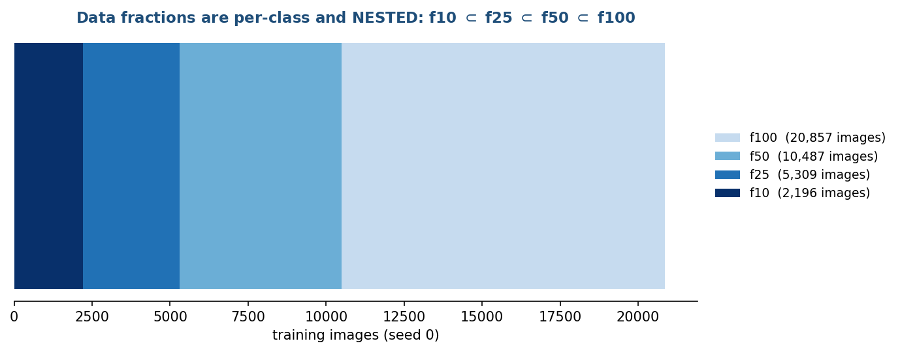

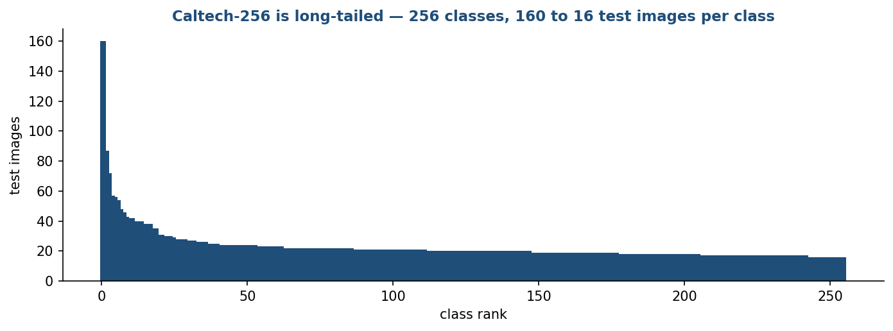

Caltech-256 is long-tailed, which is why macro-F1 and worst-decile class accuracy
are reported alongside top-1.

### 4.3 Augmentation

One modest pipeline, identical for both models:

- `RandomResizedCrop(224, scale=0.5–1.0)`
- horizontal flip (p = 0.5)
- light colour jitter (brightness/contrast/saturation 0.2, hue 0)

Heavy augmentation (mixup, CutMix, RandAugment) is **deliberately excluded**. It
interacts strongly with architecture — transformers typically benefit more — so
including it would reintroduce exactly the confound this study removes.


Evaluation uses a deterministic path with no randomness: `Resize(256)` then
`CenterCrop(224)`.

### 4.4 Optimisation

**AdamW.** Adam with *decoupled* weight decay. Adam maintains running estimates of
the gradient's mean and variance:

    m_t = β₁·m_{t−1} + (1−β₁)·g_t
    v_t = β₂·v_{t−1} + (1−β₂)·g_t²
    θ_t = θ_{t−1} − η·( m̂_t / (√v̂_t + ε)  +  λ·θ_{t−1} )

where m̂ and v̂ are m and v corrected for their bias toward zero in the first few
steps, and λ is the weight decay. Each parameter effectively gets its own learning
rate, scaled down where gradients have been large. The λ·θ term is what makes this
AdamW rather than Adam: the shrinkage is applied *directly to the weights*
(decoupled) instead of being folded into the gradient, where Adam's per-parameter
scaling would distort it. Weight decay λ = 0.05.

**Cosine schedule with linear warmup.** The learning rate starts near zero, rises
linearly over 3 epochs, then follows

    η_t = η_max · ½ · (1 + cos(π · t / T))

decaying smoothly to zero at the end of training. Here t counts optimiser steps
*after* warmup and T is the total number of post-warmup steps, which is how
`src/train/train.py` implements it — the cosine begins where the warmup ends
rather than at step zero. Warmup avoids destabilising
pre-trained weights with large early steps; the cosine decay lets the model
explore early and consolidate late.

**This schedule caused the project's most serious bug — see §10.1.** The final
settings are 15 epochs with early-stopping patience 8, chosen so the cosine
actually completes.

**Effective batch size 64** for both models, reached by gradient accumulation:
gradients from several micro-batches are summed before an optimiser step.

    effective_batch = micro_batch × accumulation_steps
    ResNet-50: 64 × 1     ViT-B/16: 32 × 2

The split differs because the ViT needs more memory per image; the *effective*
batch, and therefore the optimisation, is identical.

**Mixed precision (AMP).** Forward and backward passes run in 16-bit floating
point where safe, with a 32-bit master copy of the weights. This roughly halves
*activation* memory — weights, gradients and optimiser state remain 32-bit, so
total footprint falls by less than half — and speeds up matrix multiplication on
tensor cores. A gradient scaler multiplies the loss before
backpropagation to stop small gradients underflowing to zero in fp16.

**Determinism.** `src/utils/seed.py` seeds Python, NumPy, PyTorch and CUDA, sets
cuDNN deterministic mode, disables benchmark autotuning, and seeds each dataloader
worker. A rerun reproduces the same numbers.

---

## 5. Evaluation

### 5.1 Clean metrics

- **Top-1 accuracy** — fraction of images whose highest-scoring class is correct.
- **Top-5 accuracy** — fraction where the correct class is among the five highest.
- **Macro-F1** — F1 computed per class and then averaged *unweighted*, so a rare
  class counts as much as a common one. With per-class precision P_c and recall
  R_c:

      F1_c = 2·P_c·R_c / (P_c + R_c),    macro-F1 = (1/C)·Σ_c F1_c

  On a long-tailed dataset, top-1 can look healthy while rare classes are being
  abandoned; macro-F1 catches that.
- **Worst-decile class accuracy** — mean accuracy over the worst 10% of classes.

Every evaluation also writes a **per-image prediction table** (filepath, true
label, prediction, confidence), which is the raw material for the CPU-only
analyses in §5.5–5.6.

### 5.2 Corruption robustness

Three families at five severities each (ImageNet-C convention, Hendrycks &
Dietterich, 2019):

| corruption | severity 1 → 5 |
|---|---|
| Gaussian noise | σ = 0.08, 0.12, 0.18, 0.26, 0.38 |
| Gaussian blur | σ = 1, 2, 3, 4, 6 pixels |
| JPEG | quality = 25, 18, 15, 10, 7 |

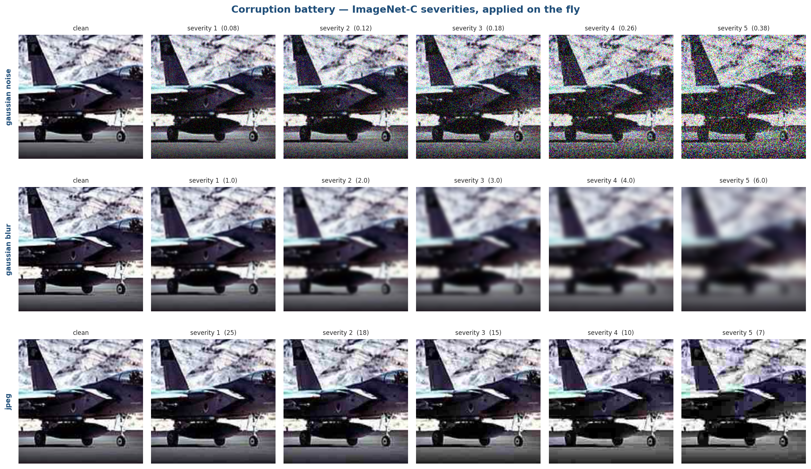

**Where the corruption is applied matters.** It goes on the 224×224 crop, in
[0,1], *before* normalisation. Two reasons:

1. Corrupting before the resize would let the resize filter some of the damage
   away, so effective severity would depend on the source image's original size.
2. Normalisation constants differ per model. Perturbing after normalisation would
   make the *physical* severity model-dependent — the two architectures would no
   longer be seeing the same degraded image.

**Determinism.** The random draw for a given (corruption, severity, image) is
derived from those three things alone via CRC32 — not Python's `hash()`, which is
salted per process. So both models are scored on byte-identical corrupted pixels,
and a rerun reproduces them exactly. Corrupted images are never written to disk.

### 5.3 Frequency probes — the mathematics

This is the mechanism half of the study, and the part most worth understanding.

**The 2-D DFT.** Any image can be decomposed into spatial-frequency components —
the visual analogue of splitting audio into bass and treble. Low frequencies carry
broad shapes and layout; high frequencies carry edges, texture and fine detail.

For one image channel x of size N×N, the discrete Fourier transform is

    X[u, v] = Σ_i Σ_j  x[i, j] · exp(−2πi·(ui + vj)/N)

`torch.fft.fft2` returns X with DC (the zero-frequency, average-brightness term)
at index [0,0], which makes "distance from DC" awkward. `fftshift` moves DC to the
centre, after which the frequency index along each axis is

    u_i = i − N/2,    u ∈ [−N/2, N/2 − 1]      (N = 224 → −112 … 111)

and the **radial frequency** of bin (i, j), in DFT bins, is

    r_ij = √(u_i² + u_j²)

Radius is reported both in bins and normalised by the axis Nyquist N/2 = 112, so
r_norm = 1.0 is Nyquist along an axis. Because the grid is square but r is radial,
the corners reach r_norm = √2 ≈ 1.414.

**Ideal filters.** A binary mask on that radius:

    low-pass(r_c):   M = 1 if r ≤ r_c, else 0
    high-pass(r_c):  M = 1 if r > r_c, else 0

Filtering is multiplication in the frequency domain:

    y = Re{ F⁻¹ { ifftshift( fftshift(F{x}) · M ) } }

The real part is taken because x is real, so its spectrum is Hermitian-symmetric,
and a radially symmetric mask preserves that symmetry — the inverse transform is
real to within ~1e-7 numerical residue.

**Three properties give free correctness checks**, all asserted in
`src/eval/frequency.py`'s self-test:

1. `M_lp(r) + M_hp(r) = 1` everywhere, and filtering is linear, so
   `lowpass(x, r) + highpass(x, r) = x`. Verified to < 1e-4.
2. The outermost populated bin sits at the corner, r = √(112² + 112²) = 158.39.
   So a low-pass at **159 bins** covers every bin and is the **identity**. Verified
   to 4e-07 — and confirmed on real trained models, where low-pass at r=159
   reproduces clean accuracy exactly.
3. Every band-limited noise sample carries identical spatial RMS with no spectral
   leakage outside its annulus.

Sweep cutoffs (bins): 4, 8, 12, 16, 24, 32, 48, 72, 112, 159.

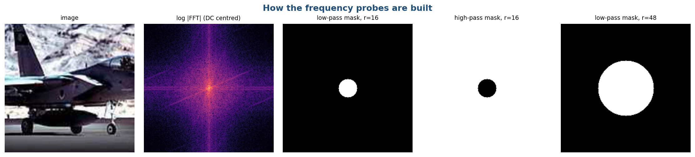

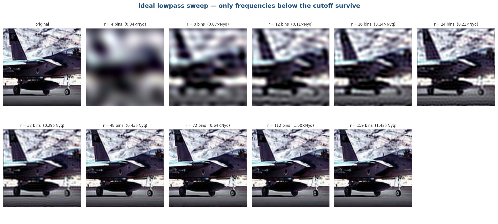

**Honest caveat:** ideal (brick-wall) filters *ring*. A sharp cutoff in frequency
is a sinc in space, so low-pass images show Gibbs halos. This is deliberate and
standard for this analysis (Park & Kim, 2022 use the same construction); a
Butterworth or Gaussian rolloff would trade ringing for an ambiguous cutoff, and
the cutoff is the independent variable of the whole experiment. Clamping back to
[0,1] afterwards is a mild nonlinearity, but feeding out-of-range pixels would be
a different and less physical distortion.

**Band-limited fixed-energy noise.** The second probe holds perturbation *energy*
constant and slides it across the spectrum, asking where the model is most
vulnerable. White Gaussian noise is generated in image space, transformed, masked
to an annulus r_lo ≤ r < r_hi, transformed back, and then **rescaled so its
spatial RMS equals a fixed target** (0.10 in [0,1] units).

The rescaling is the crucial step. An annulus near DC contains far fewer bins than
one near Nyquist, so without renormalisation the high-frequency bands would simply
carry more energy, and the curve would measure bin count rather than model
sensitivity.

Bands (bins): (0,8), (8,16), (16,32), (32,56), (56,88), (88,159).

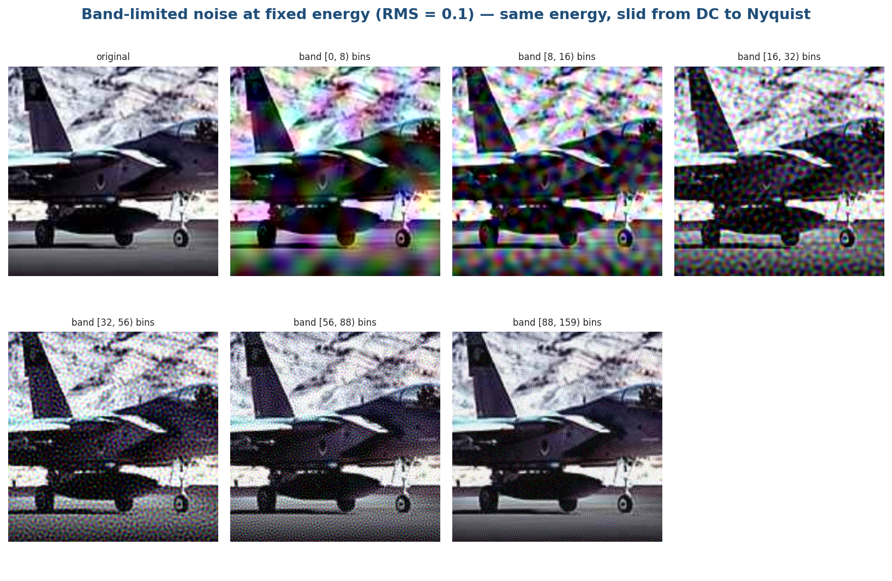

### 5.4 Why relative retention, not raw accuracy

When comparing a 10%-data model with a 100%-data model, raw accuracy under noise
conflates two things: how good the model is, and how much noise hurts it. The
contribution figure therefore divides each run's band accuracy by **its own clean
accuracy**:

    retention(band) = accuracy(band) / accuracy(clean)

This asks "what *fraction* of this model's ability survives noise in this band?",
which is the only normalisation under which a weak model and a strong model are
comparable on one axis.

### 5.5 Calibration

A model outputs a confidence with each prediction. Calibration asks whether that
number can be believed. **Expected Calibration Error** over B equal-width
confidence bins:

    ECE = Σ_b (n_b / N) · | acc(b) − conf(b) |

— the average gap between stated confidence and observed accuracy, weighted by
how many predictions land in each bin. B = 15 here (Guo et al., 2017).

Equal-*width* bins are the standard choice and make ECE comparable to published
numbers; the cost is that accurate models pile mass into the top bin, so bin
counts are reported alongside.

Sign convention: `overconfidence_gap = mean(confidence) − accuracy`. Positive
means the model overstates itself.

### 5.6 Error overlap

Do the two families fail on the same images? For matched (fraction, seed) pairs:

- the 2×2 outcome table: both correct / only A / only B / both wrong
- **Cohen's κ** on the correctness variable:

      κ = (p_o − p_e) / (1 − p_e)

  where p_o is observed agreement and p_e is the agreement expected by chance
  given each model's accuracy. This correction matters: two models that are each
  ~90% accurate agree ~82% of the time by luck alone, so raw agreement would look
  impressive and mean nothing. κ ≈ 0 means effectively independent; κ ≈ 1 means
  interchangeable.
- **same-wrong-label rate** — among images both get wrong, how often they emit the
  *same* wrong class. Shared wrong answers indicate shared inductive bias or
  genuinely ambiguous ground truth; independent wrong answers indicate different
  failure modes.
- **oracle top-1** — accuracy of a hypothetical picker that is right whenever
  *either* model is. The honest upper bound on how complementary they are.

---

## 6. Design decisions, and why they went that way

| decision | chosen | why not the alternative |
|---|---|---|
| ViT weights | `augreg_in1k` | the default `in21k_ft_in1k` is pre-trained on ~11× more data (14M vs 1.3M images); using it would have handed the ViT the comparison |
| Per-model LR | yes, declared | one shared LR would cripple whichever family it suited less — their optima are a decade apart |
| Heavy augmentation | excluded | mixup/CutMix/RandAugment interact with architecture; including them reintroduces the confound |
| Fractions | nested, per class | independent draws would confound *quantity* with *which images* |
| Test split | frozen at the start | any use in tuning turns the reported number into a training metric |
| Filters | ideal (brick-wall) | a soft rolloff makes the cutoff ambiguous, and cutoff is the independent variable |
| Corruption timing | after crop, before normalisation | see §5.2 — otherwise severity becomes model- or size-dependent |
| Band noise | fixed RMS after masking | otherwise the curve measures annulus bin count, not the model |
| Epoch budget | 15, shared | see §10.1; a shared budget is the declared protocol, per-model budgets would be a larger deviation |

---

## 7. The code, file by file

```
configs/          base.yaml (shared protocol) + per-model + per-dataset YAMLs
data/splits/      committed CSV manifests — the frozen splits
src/data/         make_splits · datasets · transforms
src/models/       factory
src/train/        train · linear_probe · run_matrix · select_lr
src/eval/         evaluate · corruptions · frequency · run_eval_battery
src/analysis/     aggregate · plots · calibration · error_overlap ·
                  replication · visual_assets · docs_index
src/utils/        seed · config · hw_monitor · provenance · runid
report/build/     facts · deckkit · docxkit · build_decks · build_reports ·
                  build_submission_guide · build_handbook
scripts/          sweeps, matrix drivers, pipeline chains
```

| file | what it does |
|---|---|
| `src/data/make_splits.py` | **The correctness anchor.** Builds the frozen splits, asserts class counts, zero overlap between train/val/test, nesting, and that every referenced file exists. Run once per dataset. |
| `src/data/datasets.py` | PyTorch Dataset reading a split CSV. Loading plus transform, nothing else. |
| `src/data/transforms.py` | `train_tfms` / `eval_tfms`, plus the split halves (`eval_geometric_tfms`, `to_tensor_norm_tfms`) the battery splices its operators between. |
| `src/models/factory.py` | `build_model` via timm with a fresh head; `feature_extractor` for probes. |
| `src/train/train.py` | One run: merged config in → `best.pt` + `metrics.json` + `train_log.csv` out. AMP, gradient accumulation, cosine+warmup, early stopping. Skips if `metrics.json` exists — this is what makes every driver crash-resumable. |
| `src/train/linear_probe.py` | Two passes: cache features once per model×dataset keyed by filepath, then fit one linear head per (fraction, seed). Evaluates itself from the cached test features. |
| `src/train/select_lr.py` | Mechanical LR selection from a sweep, by validation top-1 only, rewriting the model YAML with full provenance. |
| `src/train/run_matrix.py` | Enumerates the committed grid, sequential, resumable, prints ETA. |
| `src/eval/evaluate.py` | Checkpoint → frozen test set → metrics + per-image prediction table. |
| `src/eval/corruptions.py` | Deterministic on-the-fly corruptions, seeded per (corruption, severity, image). |
| `src/eval/frequency.py` | FFT probes. **Run `python -m src.eval.frequency` to execute its self-test.** |
| `src/eval/run_eval_battery.py` | 42 passes per checkpoint, resumable **per pass**. |
| `src/analysis/aggregate.py` | Walks `results/runs/` → `master.csv` + `curves_long.csv` + per-class / LR-sweep / deployment / compute-ledger tables. |
| `src/analysis/plots.py` | The nine report figures, one house style, colour = model identity only. |
| `src/analysis/calibration.py` · `error_overlap.py` | CPU-only, from the prediction tables. |
| `src/analysis/replication.py` | Re-tests each Caltech finding on Food-101. |
| `src/analysis/visual_assets.py` | The nine qualitative figures, with logged captions. |
| `src/utils/runid.py` | Parses run IDs **from the right** — model names contain underscores, so `split("_")` silently misaligns fields for `vit_b16`. |
| `src/utils/provenance.py` | Environment snapshot + FLOPs via torch's own counter. |
| `report/build/facts.py` | **The only source of numbers for any document.** Reads `results/tables/` and returns `(pending)` for anything absent. |

**Run-ID convention.** Every artifact is keyed by

    {model}_{dataset}_f{fraction}_s{seed}_{regime}[-suffix]

e.g. `vit_b16_caltech256_f25_s1_fullft`. The optional suffix marks protocol probes
(LR sweeps, diagnostics) that must never be counted as matrix cells.

---

## 8. Reproducing everything

### 8.1 Environment

```bash
conda create -n torch_env python=3.10 && conda activate torch_env
# torch MUST come from the PyTorch index or you get a CPU-only wheel:
pip install torch==2.5.1 torchvision==0.20.1 --index-url https://download.pytorch.org/whl/cu121
pip install -r requirements.txt
```

Verify the GPU is actually visible:

```bash
python -c "import torch; print(torch.cuda.is_available())"   # must print True
```

*If this prints False after a system update,* the usual cause is an NVIDIA
kernel-module / userspace version skew — see §10.4.

### 8.2 Data

- **Caltech-256** → `data/raw/caltech256/256_ObjectCategories/`
- **Food-101** → `bash scripts/extract_food101.sh` (downloads the official ETH
  tarball; do **not** use a Kaggle re-upload — see §10.3)

Splits are already committed. Regenerating them from scratch (rarely needed):

```bash
python -m src.data.make_splits --data configs/data_caltech256.yaml
```

### 8.3 Sanity checks before spending GPU time

```bash
python -m src.eval.frequency      # FFT self-test: identity, complementarity, band energy
python -m src.utils.runid         # run-ID parser self-test
python -m src.utils.provenance    # environment snapshot + FLOPs
```

### 8.4 The full pipeline

```bash
bash scripts/run_lr_sweep_resnet50.sh    # declared LR sweep, CNN
bash scripts/run_lr_sweep_vit_b16.sh     # declared LR sweep, ViT
bash scripts/run_pipeline.sh             # matrix → probes → battery → analysis → documents
FOOD101=1 bash scripts/run_pipeline.sh   # ... and the Food-101 block
```

Every stage is skip-if-done, so an interrupted run is simply relaunched.

### 8.5 Documents

```bash
python report/build/build_decks.py             # six decks, with speaker notes
python report/build/build_reports.py           # mid-sem and end-sem reports
python report/build/build_submission_guide.py  # what to submit and when
python report/build/build_handbook.py          # this file
```

### 8.6 Measured compute

Actual times on an RTX 4060 Laptop (8 GB), from `results/tables/compute_ledger.csv`
— these are what the runs took, not estimates:

| dataset | regime | model | runs | GPU-hours | mean run |
|---|---|---|---|---|---|
| caltech256 | fullft | resnet50 | 12 | 2.56 | 13 min |
| caltech256 | fullft | vit_b16 | 12 | 5.72 | 29 min |
| caltech256 | linprobe | resnet50 | 12 | 0.00 | 1 s |
| caltech256 | linprobe | vit_b16 | 12 | 0.00 | 1 s |
| food101 | fullft | resnet50 | 3 | 2.13 | 43 min |
| food101 | fullft | vit_b16 | 3 | 4.74 | 95 min |

Training totals 15.2 GPU-hours. The evaluation battery adds roughly 4.5 h for
the 24 Caltech-256 checkpoints (~7.7 min each) and about 2.6 h for the 6 Food-101
checkpoints, whose test split is 3.4x larger. Linear probes are effectively free
once features are cached: about 1.3 seconds per run.

---

## 9. Results

### 9.1 Data efficiency (full fine-tuning)

Frozen-test top-1, mean ± SD over 3 seeds.

| training data | ResNet-50 | ViT-B/16 | gap (pp) |
|---|---|---|---|
| **10%** | 76.18 ± 0.27 | 78.13 ± 0.45 | **+1.95** |
| **25%** | 83.19 ± 0.42 | 85.19 ± 0.14 | **+1.99** |
| **50%** | 86.65 ± 0.12 | 87.52 ± 0.18 | **+0.87** |
| **100%** | 88.87 ± 0.04 | 89.62 ± 0.23 | **+0.76** |

ViT-B/16 leads at every fraction, and every gap exceeds the pooled seed spread. The advantage is largest where data is scarcest — the reverse of the usual expectation, which applies to training from scratch rather than to transfer learning.

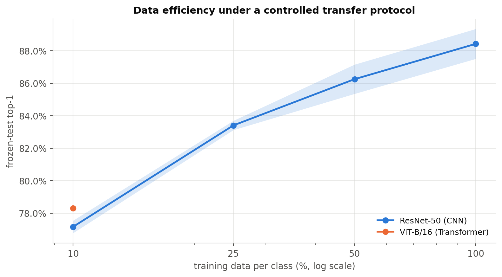

### 9.2 Linear probes (frozen features)

| training data | ResNet-50 | ViT-B/16 |
|---|---|---|
| **10%** | 74.34 | 76.59 |
| **25%** | 82.20 | 81.37 |
| **50%** | 85.75 | 83.80 |
| **100%** | 87.84 | 85.84 |

The ordering **inverts**: ViT's frozen features win only at 10%; ResNet's win at 25% and above. So the transformer's fine-tuning advantage is not that its features are better — it is that they *adapt* better.

### 9.3 Corruption robustness

| model | clean top-1 (f100) | mean accuracy lost over 15 corruption cells |
|---|---|---|
| ResNet-50 | 88.87% ± 0.04 | 27.3% |
| ViT-B/16 | 89.62% ± 0.23 | 16.7% |

On clean images the two are within a point. Under the heaviest sensor noise the difference is nearly 30 points — a benchmark reporting only clean accuracy would describe these models as near-equivalent and be badly misleading.

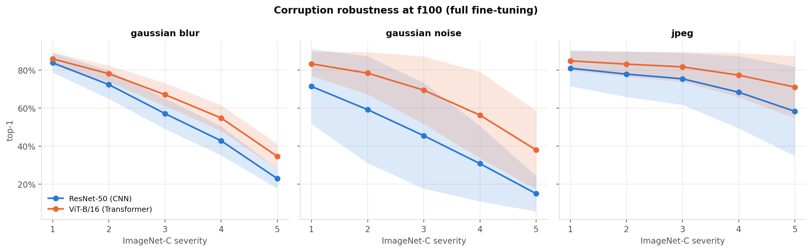

### 9.4 Frequency sensitivity

| model | low-pass AUC | high-pass AUC | most damaging noise band |
|---|---|---|---|
| ResNet-50 | 0.789 | 0.071 | 8-16 bins |
| ViT-B/16 | 0.817 | 0.066 | 16-32 bins |

ResNet-50 has a sharp low-frequency vulnerability; ViT-B/16's profile is far flatter with no comparable weak band. Real-world damage disturbs many bands at once, so a model with a sharp weak spot gets caught by it.

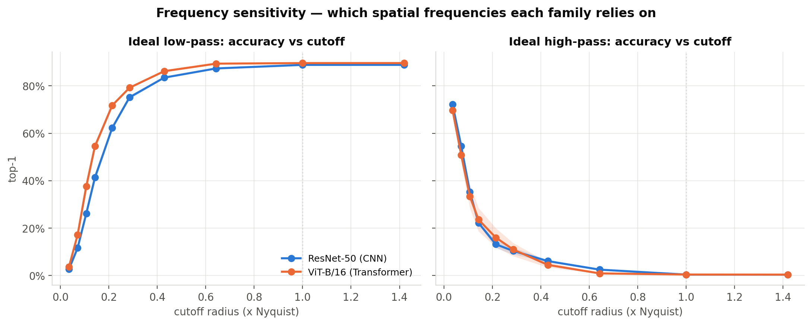

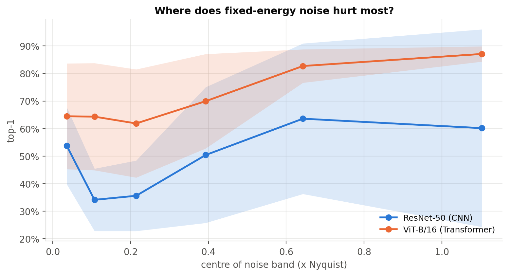

### 9.5 The contribution — spectral robustness is data-dependent for the CNN only

Change in relative retention per band between 10% and 100% training data, averaged over 3 seeds. Positive = more robust in that band as data grew.

| model | 0-8 | 8-16 | 16-32 | 32-56 | 56-88 | 88-159 |
|---|---|---|---|---|---|---|
| **ResNet-50** | +0.019 | +0.015 | +0.021 | +0.060 | +0.124 | +0.263 |
| **ViT-B/16** | -0.008 | +0.017 | +0.008 | +0.022 | +0.016 | +0.010 |

ResNet-50's profile moves by 0.263 (concentrated at high frequency, band 88-159); ViT-B/16's barely moves (0.022). A **12× difference**.

**Interpretation — and read the two subsections that follow before using it.** On Caltech-256 the CNN appears to *learn* high-frequency robustness from the fine-tuning data, while the transformer inherits a flat profile from pre-training. That would be a mechanism for the data-efficiency result rather than a restatement of it. **However, this did not reproduce on Food-101**, so the statement above is Caltech-specific; the claim that survives both datasets is in the second subsection below.

**How this differs from prior work.** Park & Kim (2022) establish that the two families differ in frequency response, at full scale. What is new here is that the difference is *itself data-dependent* — visible only under a protocol that varies the data budget while holding everything else fixed.

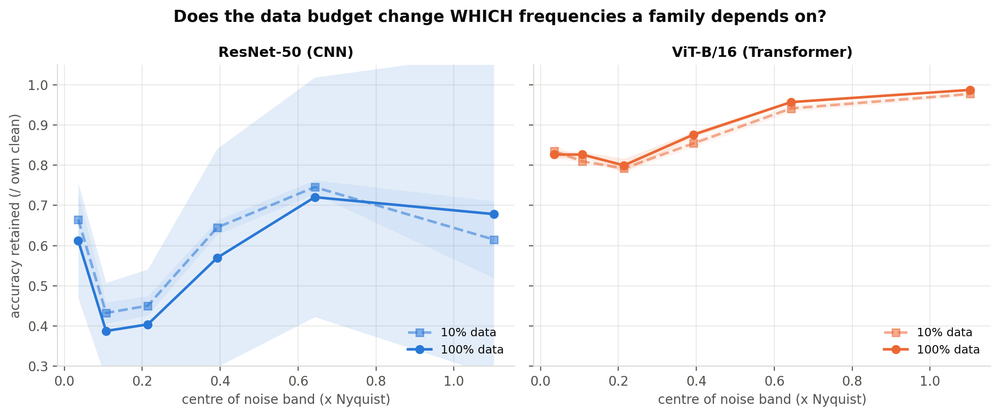

#### ⚠ This result did NOT reproduce on Food-101

| test | Caltech-256 | Food-101 |
|---|---|---|
| ResNet's profile shifts MORE than ViT's (max over bands) | 0.263 vs 0.022 (f10->f100) | 0.061 vs 0.110 (f10->f100) |
| ResNet's HIGH-frequency robustness improves more with data than ViT's | +0.263 vs +0.010 | -0.011 vs +0.019 |
| ViT's high-frequency robustness is INVARIANT across dataset and data budget; ResNet's is contingent | ResNet 0.078-0.878 (11.2x range) | ViT 0.961-0.987 (1.03x range) |

Stated plainly because it bounds how far the claim can be taken. Three qualifications separate what was measured from what can be concluded:

1. Food-101 runs **one seed**, so a single noisy band can dominate a maximum-over-bands statistic and no significance can be claimed.
2. Caltech's shift is **structured** — it grows monotonically with frequency. Food-101's bounces in sign, which is what one seed of noise looks like.
3. In the high band specifically, both Food-101 values sit near zero: *neither model moved*, rather than *the effect reversed*.

The fractions also match in proportion but not absolute size — Food-101's f10 is 7,070 images against Caltech's 2,196 — so the same nominal fraction is a substantially larger training set there.

#### What does survive both datasets

Accuracy retained under high-frequency band noise, relative to each run's own clean accuracy, in every condition measured:

| model | Caltech-256 | Food-101 | range | spread |
|---|---|---|---|---|
| **ResNet-50** | f10: 0.615; f25: 0.788; f50: 0.854; f100: 0.878 | f10: 0.090; f25: 0.095; f100: 0.078 | 0.078–0.878 | **11.2×** |
| **ViT-B/16** | f10: 0.977; f25: 0.983; f50: 0.987; f100: 0.987 | f10: 0.961; f25: 0.971; f100: 0.980 | 0.961–0.987 | **1.0×** |

ViT-B/16's spectral robustness stays within a 1.03× spread across every dataset and data budget tested. ResNet-50's varies over 11.2×. On Food-101 the CNN retains under a tenth of its accuracy against high-frequency noise at *every* data size and never improves; on Caltech it improves substantially.

**So the *direction* of the effect is dataset-specific, while the *contrast in stability* between the two families is not.** The contribution is therefore stated as: the transformer's spectral robustness is invariant to task and data budget; the convolutional network's is contingent on both.

**Provenance, stated honestly:** this broader framing was formed after examining both datasets, not predicted in advance. It is a hypothesis with support across every condition measured here, not a pre-registered result. Confirming it would require a third dataset — a concrete Phase-II objective.

### 9.6 Error overlap and calibration

| measure at f100 | value |
|---|---|
| Both models wrong | 6.5% |
| …giving the same wrong label | 44.7% |
| Cohen's κ on correctness | 0.553 |
| Oracle top-1 (either model right) | 93.54% |
| ECE — ResNet-50 / ViT-B/16 | 0.0321 / 0.0338 |

They fail on different images: the oracle sits well above either model alone, so they are complementary rather than interchangeable. And they are similarly calibrated, so the robustness difference is **not** bought by the transformer simply being less confident — an objection worth pre-empting.

### 9.7 Deployment cost

| | ResNet-50 | ViT-B/16 | ratio |
|---|---|---|---|
| Parameters (M) | 24.0 | 86.0 | 3.6× |
| GMACs @224 | 4.09 | 16.85 | 4.1× |
| Peak train VRAM (MB) | 3101 | 3621 | |

Training compute for the whole study: **15.2 GPU-hours** on one RTX 4060 Laptop GPU (8 GB).

### 9.8 Does Food-101 replicate it?

| finding | Caltech-256 | Food-101 | verdict |
|---|---|---|---|
| ViT-B/16 beats ResNet-50 at 25% data | +1.99 pp | +4.87 pp | **replicates** |
| ViT-B/16 beats ResNet-50 at 100% data | +0.76 pp | +2.10 pp | **replicates** |
| Gap narrows from 25% to 100% data | -1.24 pp change | -2.76 pp change | **replicates** |
| ViT-B/16 degrades less under corruption | 27.3% vs 16.7% drop | 56.5% vs 35.9% drop | **replicates** |
| ViT-B/16 retains more accuracy under low-pass filtering | 0.817 vs 0.789 | 0.765 vs 0.686 | **replicates** |
| ResNet's profile shifts MORE than ViT's (max over bands) | 0.263 vs 0.022 (f10->f100) | 0.061 vs 0.110 (f10->f100) | **differs** |
| ResNet's HIGH-frequency robustness improves more with data than ViT's | +0.263 vs +0.010 | -0.011 vs +0.019 | **differs** |
| ViT's high-frequency robustness is INVARIANT across dataset and data budget; ResNet's is contingent | ResNet 0.078-0.878 (11.2x range) | ViT 0.961-0.987 (1.03x range) | **replicates** |

Two cautions. Food-101 runs **one seed** by design, so it supports statements about direction, not significance. And a finding that holds on one dataset and not the other indicates *dataset dependence*, not an error in the first measurement — the Caltech result rests on its own internal validity (frozen split, three seeds, one protocol).


### 9.9 Audit: what an independent check found

The findings were audited against the literature and against 463 automated
internal-consistency checks. No computational errors were found. Three
qualifications emerged that bound what can be claimed, and they are stated here
rather than buried:

**1. Pre-training recipe is not controlled — only pre-training data.** Both
checkpoints are ImageNet-1k, which is the control most published comparisons get
wrong and which this project deliberately gets right. But they come from
different recipes: ResNet-50 from *ResNet strikes back* (LAMB, BCE loss,
mixup/CutMix, RandAugment, ~600 epochs) and ViT-B/16 from *AugReg* (strong
augmentation plus heavy regularization). Augmentation strength during
pre-training is known to affect corruption robustness substantially. So the
robustness and frequency results may partly reflect recipe rather than
architecture. The defensible claim is about **these two released checkpoints,
fine-tuned identically** — not about the two families in general. Controlling it
would require pre-training both from scratch under one recipe, which is far
beyond a laptop GPU.

**2. One published result points the other way.** Bhojanapalli et al. (2021)
report that with ImageNet-1k pre-training specifically, ViTs were *less* robust
than CNNs on ImageNet-C, converging only with ImageNet-21k or JFT-300M. This
project finds the opposite after transfer. The settings differ — they evaluate
in-domain, this evaluates after fine-tuning on a different dataset — but the
discrepancy is recorded rather than ignored.

**3. Constant noise RMS is not constant signal-to-noise ratio.** Natural images
have approximately 1/f² power spectra, so the same noise RMS is a much larger
*relative* perturbation at high frequency where there is little signal. Both
models face identical noise, so the model-versus-model comparison holds; but
reading a curve minimum as a pure measure of "which band this model relies on" is
not licensed by the design.

Consistency with Park & Kim (2022) was confirmed on four independent measurements
— though note that they characterise what the *operations* do to feature maps
while this measures *input-frequency robustness*. Related, not identical.

Full audit: `AUDIT.md`.


---

## 10. Mistakes made, and what they cost

This section exists because it is the most transferable part of the project.
Every item below was caught during the work, not anticipated.


### 10.1 The learning-rate schedule fought the early-stopping rule

**The most serious error in the project, and it nearly inverted the headline.**

The declared schedule was a 30-epoch cosine with early stopping at patience 5.
Over 30 epochs the learning rate is still ~9e-5 at epoch 8, so validation accuracy
sits on a noisy plateau — and patience expired *there*, killing runs before the
annealing phase that actually converges the model.

Measured at f100, seed 0, same LR and same seed:

| model | 30-ep truncated | 8-ep annealed | 12-ep annealed | 15-ep annealed | runs cut short |
|---|---|---|---|---|---|
| ResNet-50 | 89.20 | 89.43 | — | 89.73 | 8 of 12 |
| ViT-B/16 | 87.34 | 90.37 | 90.04 | 89.26 | **10 of 10** |

The truncation cost the transformer 2.7–3.0 pp and the CNN 0.2 — a **15×
asymmetry**. Under the broken protocol the measured gap decayed with data and
*reversed sign* (+1.38 → +0.91 → −0.45 pp). Under the corrected one it never
crosses. Same data, same seeds.

**The tell was visible in the logs the whole time:** every ViT run early-stopped,
and ViT's best epoch moved *earlier* as data grew (14–17 at f10, 3 at f100). That
is the signature of stopping on plateau noise rather than on convergence.

**Lesson.** A schedule and a stopping rule are not independent settings. If the
schedule needs N epochs to anneal, the stopping rule must not be able to fire
before then. Check *how* runs terminate, not just what they score.

### 10.2 A shared learning rate is not the neutral choice it looks like

The linear probe originally used one LR (1e-3) for both models, on the reasoning
that fitting a linear head on frozen features is near-convex and therefore free of
architecture-specific dynamics. The sweep falsified that:

| model | 1e-4 | 1e-3 | 1e-2 | 1e-1 | 1.0 |
|---|---|---|---|---|---|
| ResNet-50 | 0.5160 | 0.8755 | 0.8883 | **0.8896** | 0.8024 |
| ViT-B/16 | 0.8145 | **0.8556** | 0.8529 | 0.8230 | — |

The optima sit a **decade apart** — 2048-d pooled CNN features and 768-d ViT
features are differently scaled and conditioned. Running both at 1e-3 cost the
ResNet probe **21 pp at f10**.

**Lesson.** "Same value for both" is only fair when the value means the same thing
to both. Sweep it and find out rather than assuming.

### 10.3 A dataset archive that was quietly corrupt

The staged Food-101 zip failed three ways, each masking the next:

1. Its 5.0 GB payload member broke Debian's UnZip 6.00 (zip64 >4 GB) — it aborted
   part-way while still printing "inflating".
2. Extracting that member correctly with Python then failed at stage two: the
   inner archive's central directory records local-header offsets inflated by 2³²
   for 71% of members, non-uniformly. About 16% of images would have gone missing
   in an unpredictable pattern.
3. Independently: it carried 101,000 real JPEGs **and** 101,000 macOS AppleDouble
   `._*.jpg` resource forks. `make_splits.py` globs by extension, so extracting
   them would have doubled the dataset with 4 KB corrupt files and silently
   poisoned every Food-101 number.

Fixed by downloading the official ETH Zurich tarball instead.

**Lesson.** Validate dataset counts against the published figures *before*
training on them, and make the extraction script assert them rather than report
them.

### 10.4 CUDA vanished after a routine system update

`torch.cuda.is_available()` returned False. Cause: an apt upgrade installed NVIDIA
userspace 580.173.02 while the machine was still booted into a kernel carrying the
580.159.03 module. Userspace and kernel module must match exactly.

Diagnosis: compare `nvidia-smi` output against `cat /proc/driver/nvidia/version`.
Fix: boot the kernel whose module matches, or reinstall the module for the running
kernel.

**Lesson.** It looks like a PyTorch problem and is not.

### 10.5 Parsing identifiers with `split()`

Run IDs look like `{model}_{dataset}_f{frac}_s{seed}_{regime}`, so
`run_id.split("_")` seems fine — until a model name contains an underscore:

    resnet50_caltech256_f10_s0_fullft  → 5 fields, indexes line up by luck
    vit_b16_caltech256_f10_s0_fullft   → 6 fields, every index shifts

It crashed loudly (`int("altech256")`), which was the lucky outcome; any shifted
field that still parsed would have written silently mislabelled rows into the
tables the report reads. Fixed by parsing **from the right** in
`src/utils/runid.py`.

### 10.6 Smaller traps worth knowing

- **YAML scientific notation.** PyYAML resolves a float only with *both* a decimal
  point and a signed exponent. `probe_lr: 1e-1` loads as the **string** `"1e-1"`
  and fails deep inside the optimizer. Write `1.0e-1`.
- **Completion markers.** `train.py` writes `best.pt` whenever validation improves
  but `metrics.json` only at the end. The battery originally discovered
  checkpoints by `best.pt`, so a killed run's half-trained weights would have been
  scored as a finished matrix cell — producing entirely plausible-looking curves.
- **Editing a running bash script.** Bash reads scripts by byte offset, so
  changing one mid-run makes it resume mid-token. Restart instead.
- **Suffix filtering.** `aggregate.py` excluded runs matching `"sweep"` but not
  other suffixes, so a schedule diagnostic was pulled into `master.csv` as an
  extra run reusing a real cell's identity.
- **`git add -A` after archiving.** Moving checkpoints to `results/archive/` put
  them outside the `results/checkpoints/*` ignore rule; 4.3 GB of weights were one
  command from entering git history.


---

## 11. Glossary

| term | meaning |
|---|---|
| **AMP** | Automatic Mixed Precision — running parts of training in 16-bit floats to save memory and time |
| **Attention** | Operation letting every element of a sequence consult every other directly |
| **Calibration** | Whether a model's stated confidence matches its actual accuracy |
| **Cohen's κ** | Agreement between two raters, corrected for agreement expected by chance |
| **Convolution** | Sliding a small learned filter across an image |
| **DFT / FFT** | Discrete Fourier Transform — decomposes a signal into frequency components; FFT is the fast algorithm |
| **ECE** | Expected Calibration Error |
| **Epoch** | One complete pass over the training set |
| **Fine-tuning** | Continuing training a pre-trained model on a new task |
| **Gradient accumulation** | Summing gradients over several small batches before an update, to simulate a larger batch |
| **Inductive bias** | Assumption built into an architecture rather than learned from data |
| **Linear probe** | Training only a final linear layer on a frozen model's features |
| **Logits** | Raw, unbounded class scores before softmax |
| **Learning rate** | How large a correction the model makes per update |
| **Macro-F1** | F1 averaged unweighted over classes, so rare classes count fully |
| **Nyquist frequency** | Highest frequency representable on a given sampling grid |
| **Patch embedding** | Turning image patches into vectors for a transformer |
| **Softmax** | Converts logits into probabilities summing to 1 |
| **Spatial frequency** | Rate of intensity change across an image: low = broad shapes, high = fine detail |
| **timm** | PyTorch Image Models — the library supplying both pre-trained backbones |
| **Top-1 / Top-5** | Whether the correct class is the highest-scoring / among the five highest |
| **Transfer learning** | Reusing knowledge from one task on another |
| **Weight decay** | Penalty that shrinks weights toward zero, discouraging over-complex solutions |

---

## 12. References

1. Vaswani, A. et al. (2017). *Attention Is All You Need.* NeurIPS.
2. Dosovitskiy, A. et al. (2021). *An Image Is Worth 16×16 Words: Transformers for Image Recognition at Scale.* ICLR.
3. Touvron, H. et al. (2021). *Training Data-Efficient Image Transformers & Distillation through Attention.* ICML.
4. He, K. et al. (2016). *Deep Residual Learning for Image Recognition.* CVPR.
5. Park, N. & Kim, S. (2022). *How Do Vision Transformers Work?* ICLR.
6. Yin, D. et al. (2019). *A Fourier Perspective on Model Robustness in Computer Vision.* NeurIPS.
7. Hendrycks, D. & Dietterich, T. (2019). *Benchmarking Neural Network Robustness to Common Corruptions and Perturbations.* ICLR.
8. Guo, C. et al. (2017). *On Calibration of Modern Neural Networks.* ICML.
9. Goldblum, M. et al. (2023). *Battle of the Backbones.* NeurIPS.
10. Loshchilov, I. & Hutter, F. (2019). *Decoupled Weight Decay Regularization.* ICLR.
11. Steiner, A. et al. (2021). *How to Train Your ViT?* TMLR.

---

*Generated by `report/build/build_handbook.py` from `results/tables/`. Every number
above traces to a run on disk; see `results/DOCUMENTATION_INDEX.md`.*
